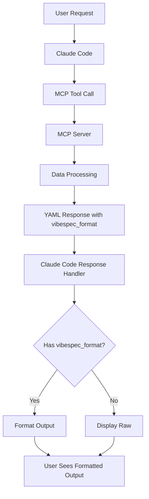
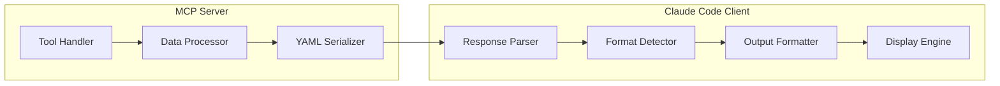

# Design Document: MCP Output Display Optimization

## Overview

This feature transforms the VibeSpecs MCP tools from server-side formatting to client-side formatting architecture. Instead of returning complex ASCII art and box-drawing characters that get collapsed in Claude Code, MCP tools will return structured YAML data that Claude Code can detect and format appropriately for optimal user experience.

### Key Design Principles
1. **Separation of Concerns**: Data logic in MCP tools, presentation logic in Claude Code
2. **Progressive Enhancement**: Graceful fallback when detection fails
3. **Maintainability**: Simple, testable components with clear interfaces
4. **Performance**: Minimal overhead for JSON parsing and formatting

## Architecture

### High-Level Architecture



### Component Architecture



## Components and Interfaces

### 1. MCP Tool Output Format

#### Standard Response Schema
```yaml
vibespec_format: v1              # Version identifier for detection
type: string                     # Content type for formatting selection
data:                           # Actual structured data
  # ... specific data structure
metadata:                       # Optional metadata
  timestamp: "2025-07-25T08:15:00Z"
  session_id: "buvbwccek3wg"
  # ... additional metadata
```

```typescript
interface VibeSpecResponse {
  vibespec_format: "v1";           // Version identifier for detection
  type: string;                    // Content type for formatting selection
  data: any;                       // Actual structured data
  metadata?: {                     // Optional metadata
    timestamp?: string;
    session_id?: string;
    [key: string]: any;
  };
}
```

#### Content Types
- `"spec_list"`: Specifications list view
- `"spec_detail"`: Individual specification details
- `"spec_status_update"`: Status update confirmation
- `"spec_archive"`: Archive/restore confirmation
- `"error"`: Error information

### 2. Data Models

#### Spec List Data Model
```typescript
interface SpecListData {
  specs: SpecMetadata[];
  filter: string;
  count: number;
  summary: {
    total: number;
    active: number;
    completed: number;
    archived: number;
  };
}
```

#### Spec Detail Data Model
```typescript
interface SpecDetailData {
  spec: SpecStatus;
  taskProgress?: TaskProgress;
  fileSizes?: Record<string, number>;
  documents: {
    requirements: string;
    design: string;
    tasks: string;
  };
}
```

#### Error Data Model
```typescript
interface ErrorData {
  message: string;
  code: string;
  suggestion: string;
  context?: any;
}
```

### 3. TODO Progress Tracking System

#### Parser Interface
```typescript
interface TODOParser {
  parseTasks(content: string): TODOItem[];
  calculateProgress(items: TODOItem[]): ProgressSummary;
}

interface TODOItem {
  id: string;
  text: string;
  completed: boolean;
  priority?: 'high' | 'medium' | 'low';
  line: number;
}

interface ProgressSummary {
  total: number;
  completed: number;
  percentage: number;
  currentTask?: TODOItem;
  nextTasks: TODOItem[];
}
```

#### Supported TODO Formats
- `- [ ] Task description` (uncompleted)
- `- [x] Task description` (completed)
- `- [X] Task description` (completed, alternate)
- Custom priority markers: `- [ ] [HIGH] Task`

### 4. Claude Code Formatting System

#### Format Detection
```typescript
interface FormatDetector {
  isVibeSpecFormat(response: string): boolean;
  parseResponse(response: string): VibeSpecResponse | null;
  getFormatter(type: string): OutputFormatter;
}
```

#### Output Formatters
```typescript
interface OutputFormatter {
  format(data: any): string;
  formatError(error: ErrorData): string;
}

// Specific formatter implementations
class SpecListFormatter implements OutputFormatter { /* ... */ }
class SpecDetailFormatter implements OutputFormatter { /* ... */ }
class StatusUpdateFormatter implements OutputFormatter { /* ... */ }
class ArchiveFormatter implements OutputFormatter { /* ... */ }
```

## Detailed Design

### 1. MCP Tool Modifications

#### Before (Complex Formatting)
```typescript
export async function listSpecs(params: ListToolParams): Promise<string> {
  const specs = await statusManager.loadAllSpecs();
  return outputFormatter.formatSpecList(specs); // Returns ASCII art
}
```

#### After (Structured Data)
```typescript
import * as yaml from 'js-yaml';

export async function listSpecs(params: ListToolParams): Promise<string> {
  const specs = await statusManager.loadAllSpecs();
  return yaml.dump({
    vibespec_format: "v1",
    type: "spec_list",
    data: {
      specs: specs.filter(/* apply filter */),
      filter: params.status_filter || 'all',
      count: specs.length,
      summary: calculateSummary(specs)
    }
  });
}
```

### 2. Claude Code Integration

#### Detection Logic
```typescript
import * as yaml from 'js-yaml';

function detectAndFormat(toolResponse: string): string {
  try {
    const parsed = yaml.load(toolResponse) as any;
    if (parsed?.vibespec_format === "v1") {
      const formatter = getFormatter(parsed.type);
      return formatter.format(parsed.data);
    }
  } catch (e) {
    // Not YAML or not our format, fall back to raw
  }
  return toolResponse; // Original response
}
```

#### Simple Formatting Examples

**Spec List Output:**
```
## 📋 VibeSpecs Overview

**Active Specs:**
• 🔷 mcp-output-optimization (In Progress) - Updated 5 min ago
  Session: buvbwccek3wg | Stage: design | Progress: 60%

• ✅ user-authentication (Completed) - Updated 2 days ago  
  Session: yn48cgsv56yr | Stage: exec | Tasks: 8/8

**Summary:** 2 specs • 1 active • 1 completed
```

**Spec Detail Output:**
```
## 🎯 Spec Details: mcp-output-optimization

**Basic Info:**
• Session ID: buvbwccek3wg
• Feature: mcp-output-optimization  
• Status: In Progress | Stage: Design
• Created: 2025-07-25 08:00 | Updated: 2025-07-25 08:15

**Workflow Progress:**
• ✅ Goal Collection (Completed)
• ✅ Requirements Gathering (Completed) 
• 🔄 Design Documentation (Active)
• ⏳ Task Planning (Pending)
• ⏳ Task Execution (Pending)

**Task Progress:** 5/9 tasks completed (56%)
• Current: Create detailed design document
• Next: Design CC-side formatting logic

**Documents:**
• 📋 requirements.md (2.1 KB)
• 📐 design.md (0.8 KB) 
• ✅ tasks.md (1.5 KB)
```

### 3. TODO Progress Integration

#### Enhanced Task Progress Parsing
```typescript
async function parseTaskProgress(tasksFile: string): Promise<TaskProgress> {
  const content = await fs.readFile(tasksFile, 'utf-8');
  const parser = new TODOParser();
  const items = parser.parseTasks(content);
  const progress = parser.calculateProgress(items);
  
  return {
    total: progress.total,
    completed: progress.completed,
    percentage: progress.percentage,
    currentTask: progress.currentTask?.text,
    nextTasks: progress.nextTasks.slice(0, 3).map(t => t.text)
  };
}
```

#### TODO Parsing Logic
```typescript
class TODOParser {
  private readonly TODO_PATTERNS = [
    /^[\s]*-\s*\[\s*\]\s*(.+)$/,     // - [ ] uncompleted
    /^[\s]*-\s*\[[xX]\]\s*(.+)$/,   // - [x] completed
    /^[\s]*\*\s*\[\s*\]\s*(.+)$/,   // * [ ] uncompleted
    /^[\s]*\*\s*\[[xX]\]\s*(.+)$/,  // * [x] completed
  ];

  parseTasks(content: string): TODOItem[] {
    const lines = content.split('\n');
    const items: TODOItem[] = [];
    
    lines.forEach((line, index) => {
      for (const pattern of this.TODO_PATTERNS) {
        const match = line.match(pattern);
        if (match) {
          items.push({
            id: `task-${index}`,
            text: match[1].trim(),
            completed: /\[[xX]\]/.test(line),
            line: index + 1
          });
          break;
        }
      }
    });
    
    return items;
  }
}
```

## Error Handling

### 1. YAML Parsing Errors
- **Strategy**: Graceful fallback to original output
- **Logging**: Log parsing errors for debugging
- **User Impact**: Zero - users see original response

### 2. Formatting Errors  
- **Strategy**: Return simple text version of data
- **Fallback**: Basic key-value pair display
- **Recovery**: Attempt alternative formatters

### 3. Missing Data Errors
- **Strategy**: Show partial information with indicators
- **Handling**: Display "N/A" for missing fields
- **Graceful**: Never crash the entire output

### Error Response Format
```typescript
interface ErrorResponse {
  vibespec_format: "v1";
  type: "error";
  data: {
    message: string;
    code: string;
    suggestion: string;
    originalError?: any;
  };
}
```

## Testing Strategy

### 1. Unit Tests

#### MCP Tool Output Tests
```typescript
import * as yaml from 'js-yaml';

describe('MCP Tool YAML Output', () => {
  test('listSpecs returns valid YAML with vibespec_format', () => {
    const result = await listSpecs({});
    const parsed = yaml.load(result) as any;
    expect(parsed.vibespec_format).toBe('v1');
    expect(parsed.type).toBe('spec_list');
    expect(parsed.data).toBeDefined();
  });
});
```

#### Formatter Tests
```typescript
describe('SpecListFormatter', () => {
  test('formats empty spec list correctly', () => {
    const formatter = new SpecListFormatter();
    const result = formatter.format({ specs: [], count: 0 });
    expect(result).toContain('No specs found');
  });
});
```

### 2. Integration Tests

#### End-to-End Workflow Tests
```typescript
describe('Full Output Pipeline', () => {
  test('MCP call to formatted output', async () => {
    const mcpResponse = await callMCPTool('vibedev_specs_list', {});
    const formatted = detectAndFormat(mcpResponse);
    expect(formatted).toContain('📋 VibeSpecs Overview');
  });
});
```

### 3. TODO Parser Tests

#### Format Compatibility Tests
```typescript
describe('TODOParser', () => {
  test('parses various TODO formats', () => {
    const content = `
- [ ] Uncompleted task
- [x] Completed task
- [X] Completed task (alternate)
* [ ] Bullet uncompleted
* [x] Bullet completed
    `;
    const parser = new TODOParser();
    const items = parser.parseTasks(content);
    expect(items).toHaveLength(5);
    expect(items.filter(i => i.completed)).toHaveLength(3);
  });
});
```

### 4. Performance Tests

#### YAML Serialization Performance
- Test large spec lists (100+ items)
- Measure parsing time for complex TODO files
- Verify memory usage stays within bounds

#### Formatting Performance  
- Benchmark different formatter implementations
- Test with various content sizes
- Validate UI responsiveness

## Migration Plan

### Phase 1: Foundation (Week 1)
1. ✅ Update `list.ts` and `get_status.ts` to return JSON format
2. Create basic format detection logic in Claude Code
3. Implement simple spec list formatter
4. Add comprehensive tests

### Phase 2: Enhancement (Week 2)  
1. Update remaining tools (`update_status.ts`, `archive.ts`)
2. Implement TODO progress parsing
3. Create detailed spec formatter
4. Add error handling and fallbacks

### Phase 3: Polish (Week 3)
1. Performance optimization
2. Edge case handling
3. Documentation updates
4. User feedback integration

### Rollback Strategy
- Keep existing `OutputFormatter` class as fallback
- Use feature flags to control new vs old formatting
- Monitor error rates and user feedback
- Easy switch back if issues arise

## Success Metrics

### User Experience Metrics
- **Visibility**: 100% of formatted output visible (not collapsed)
- **Readability**: User feedback on output clarity
- **Performance**: <50ms additional formatting time

### Technical Metrics
- **Reliability**: <1% parsing/formatting errors
- **Coverage**: All MCP tools use new format
- **Compatibility**: Zero breaks in existing functionality

### Quality Metrics
- **Test Coverage**: >90% for new formatting code
- **Documentation**: All APIs documented
- **Maintainability**: Code review standards met

## Future Enhancements

### Short Term (Next Release)
- Color support for terminal output
- Configurable verbosity levels
- Custom formatting themes

### Long Term (Future Releases)
- Web dashboard integration
- Mobile-friendly formatting
- Internationalization support
- Advanced progress visualizations