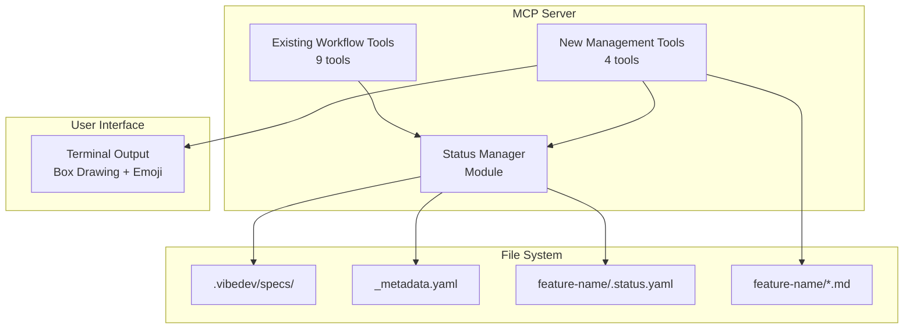

# Design Document: Spec Management Tools

## Overview

This design document outlines the technical architecture for adding spec management capabilities to the vibedev-specs-mcp server. The implementation will introduce four new MCP tools that provide comprehensive spec tracking, viewing, and management functionality while maintaining full backward compatibility with the existing workflow tools.

### Design Goals
- Minimal token consumption through efficient YAML format
- Beautiful terminal output using box-drawing characters and emojis
- Zero disruption to existing workflow
- Fast performance with 100+ specs
- Cross-platform compatibility

## Architecture

### System Architecture Diagram



### Data Flow

1. **Workflow Integration**: Existing workflow tools trigger status updates through the Status Manager
2. **Status Persistence**: Status Manager handles all YAML file operations atomically
3. **Query Operations**: Management tools read status files and render formatted output
4. **Update Operations**: Manual updates go through validation before persisting

## Components and Interfaces

### 1. Status Manager Module (`/src/utils/status-manager.ts`)

Core module responsible for all status persistence operations.

```typescript
interface StatusManager {
  // Read operations
  loadSpecStatus(sessionId: string): Promise<SpecStatus>;
  loadAllSpecs(): Promise<SpecMetadata[]>;
  
  // Write operations
  updateSpecStatus(sessionId: string, updates: Partial<SpecStatus>): Promise<void>;
  createSpecStatus(sessionId: string, featureName: string): Promise<void>;
  
  // Utility operations
  ensureMetadataIndex(): Promise<void>;
  parseTaskProgress(taskFile: string): Promise<TaskProgress>;
}
```

### 2. New MCP Tools

#### Tool 1: `vibedev_specs_list`
```typescript
interface ListToolParams {
  status_filter?: 'all' | 'in_progress' | 'completed' | 'archived' | 'paused';
}

// Output: Formatted box-drawing table with emoji indicators
```

#### Tool 2: `vibedev_specs_get_status`
```typescript
interface GetStatusParams {
  session_id: string;
  feature_name?: string; // Optional, can derive from session_id
}

// Output: Detailed status box with progress bars
```

#### Tool 3: `vibedev_specs_update_status`
```typescript
interface UpdateStatusParams {
  session_id: string;
  status?: 'in_progress' | 'completed' | 'archived' | 'paused';
  stage?: string;
  task_completed?: number;
  notes?: string;
}

// Output: Confirmation message with updated status
```

#### Tool 4: `vibedev_specs_archive`
```typescript
interface ArchiveParams {
  session_id: string;
  action: 'archive' | 'restore';
}

// Output: Confirmation with status change
```

### 3. Output Formatter Module (`/src/utils/output-formatter.ts`)

Handles all terminal formatting with box-drawing characters and emojis.

```typescript
interface OutputFormatter {
  formatSpecList(specs: SpecMetadata[]): string;
  formatSpecDetail(spec: SpecStatus): string;
  formatProgressBar(current: number, total: number): string;
  formatError(error: Error): string;
}
```

## Data Models

### 1. Status File Format (`.status.yaml`)

```yaml
# Compact format to minimize token usage
sid: bfci49zyzihu
name: spec-management-tools
created: 2025-01-25T10:00:00Z
updated: 2025-01-25T15:30:00Z
stage: execution
status: in_progress  # in_progress | completed | archived | paused
notes: "Custom notes here"
stages:
  goal: [done, 2025-01-25T10:30:00Z]
  req: [done, 2025-01-25T11:00:00Z]
  design: [done, 2025-01-25T12:00:00Z]
  tasks: [done, 2025-01-25T13:00:00Z, 10, 7]  # [status, timestamp, total, completed]
  exec: [active, 2025-01-25T14:00:00Z, 8]     # [status, timestamp, current_task]
```

### 2. Metadata Index Format (`_metadata.yaml`)

```yaml
# Global index for quick spec discovery
specs:
  - sid: bfci49zyzihu
    name: spec-management-tools
    status: in_progress
    updated: 2025-01-25T15:30:00Z
  - sid: abc123def456
    name: user-authentication
    status: completed
    updated: 2025-01-20T10:00:00Z
    archived_at: null
```

### 3. TypeScript Interfaces

```typescript
interface SpecStatus {
  sid: string;
  name: string;
  created: string;
  updated: string;
  stage: 'goal' | 'req' | 'design' | 'tasks' | 'exec';
  status: 'in_progress' | 'completed' | 'archived' | 'paused';
  notes?: string;
  stages: {
    goal: StageInfo;
    req: StageInfo;
    design: StageInfo;
    tasks: TaskStageInfo;
    exec: ExecStageInfo;
  };
}

type StageInfo = [StageStatus, string]; // [status, timestamp]
type TaskStageInfo = [StageStatus, string, number, number]; // [status, timestamp, total, completed]
type ExecStageInfo = [StageStatus, string, number]; // [status, timestamp, current_task]
type StageStatus = 'pending' | 'active' | 'done';
```

## Implementation Details

### 1. Backward Compatibility Strategy

- **Hook Integration**: Add status update calls to existing workflow tools without modifying their core logic
- **Graceful Degradation**: If status files are missing, tools infer status from existing .md files
- **Non-Breaking Changes**: New tools are additive only, no modifications to existing tool signatures

### 2. File Operation Safety

```typescript
// Atomic write operation example
async function atomicWrite(filePath: string, content: string) {
  const tempPath = `${filePath}.tmp`;
  await fs.writeFile(tempPath, content, 'utf8');
  await fs.rename(tempPath, filePath); // Atomic on most systems
}
```

### 3. Performance Optimizations

- **Lazy Loading**: Only parse detailed status when needed
- **Parallel Processing**: Use Promise.all for reading multiple specs
- **Efficient Search**: Index specs by both session_id and feature_name
- **Direct File Access**: Always read fresh data from files for accuracy

### 4. Terminal Output Examples

```typescript
// Progress bar implementation
function formatProgressBar(current: number, total: number): string {
  const percentage = Math.round((current / total) * 100);
  const filled = Math.round(percentage / 10);
  const empty = 10 - filled;
  return `${'█'.repeat(filled)}${'░'.repeat(empty)} ${percentage}%`;
}

// Box drawing example
const BOX_CHARS = {
  TL: '╔', TR: '╗', BL: '╚', BR: '╝',
  H: '═', V: '║', 
  ML: '╠', MR: '╣', MT: '╦', MB: '╩'
};
```

## Error Handling

### Error Categories and Responses

1. **File System Errors**
   - Missing directory → Create it automatically
   - Permission denied → Clear error with fix instructions
   - Disk full → Suggest cleanup actions

2. **Data Integrity Errors**
   - Corrupted YAML → Attempt recovery from backup or rebuild from .md files
   - Missing required fields → Use sensible defaults
   - Invalid status values → Revert to last known good state

3. **Concurrency Errors**
   - File lock timeout → Retry with exponential backoff
   - Conflicting updates → Last-write-wins with conflict logging

### Error Message Format

```typescript
interface ErrorResponse {
  error: string;
  code: string;
  suggestion: string;
  details?: any;
}

// Example:
{
  error: "Failed to read spec status",
  code: "SPEC_NOT_FOUND",
  suggestion: "Check if the session ID is correct or use 'vibedev_specs_list' to see all specs",
  details: { sessionId: "xyz123" }
}
```

## Testing Strategy

### Unit Tests

1. **Status Manager Tests**
   - YAML parsing/writing
   - Atomic operations
   - Error recovery
   - File consistency

2. **Tool Tests**
   - Parameter validation
   - Output formatting
   - Error handling
   - Edge cases

### Integration Tests

1. **Workflow Integration**
   - Status updates from existing tools
   - Concurrent tool usage
   - Large dataset handling (100+ specs)

2. **Cross-Platform Tests**
   - File path handling (Windows/Unix)
   - Unicode rendering
   - Terminal compatibility

### Performance Tests

- Load 100+ specs < 2 seconds
- Single spec query < 100ms
- Status update < 50ms

## Security Considerations

1. **Input Validation**: Sanitize all user inputs to prevent path traversal
2. **File Permissions**: Respect system file permissions
3. **No Sensitive Data**: Never store credentials or tokens in status files

## Migration Strategy

For existing vibedev-specs installations:

1. **Auto-Migration**: First run creates status files from existing .md files
2. **Backward Compatible**: Old specs without status files still work
3. **Progressive Enhancement**: Status tracking improves with usage

---

Does the design look good? If so, we can move on to the implementation plan.